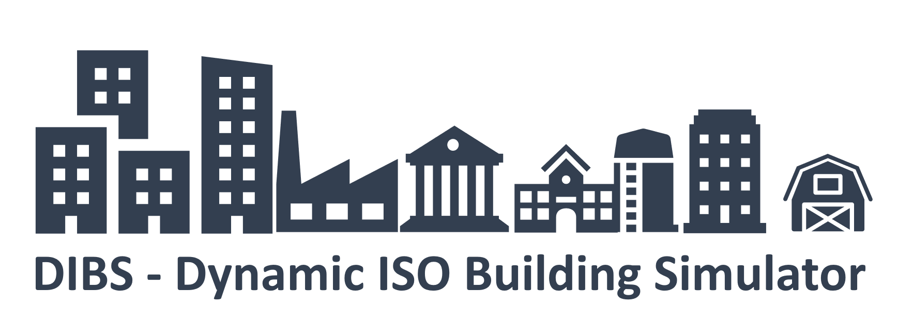
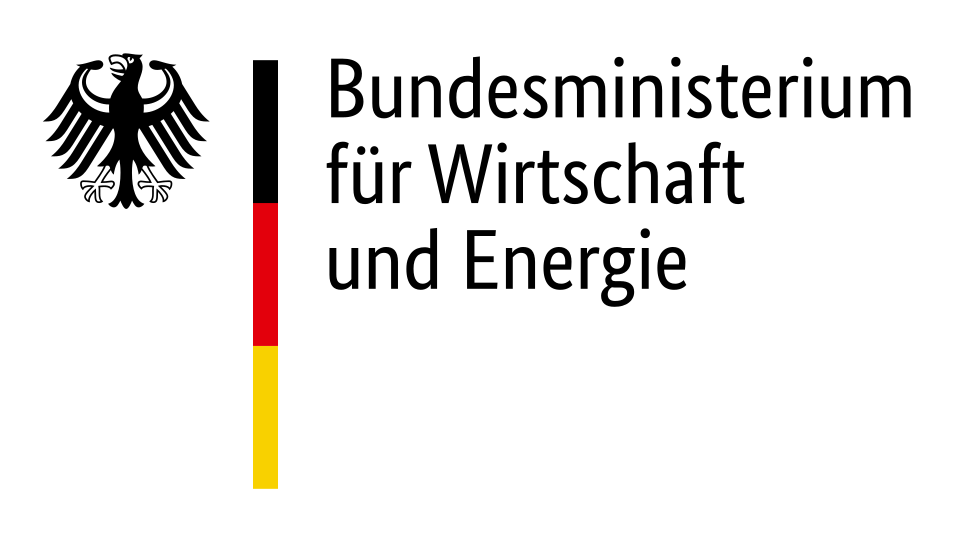

Dynamic ISO Building Simulator (DIBS) is a simulation program for calculating the space heating, cooling and electricity demand of German non-residential buildings. The adapted hourly dynamic building energy simulator for single buildings and building stocks is ready to use with [ENOB:dataNWG interview](https://www.datanwg.de/stichprobenerhebung/breitenerhebung) and [on-site inspection](https://www.datanwg.de/stichprobenerhebung/tiefenerhebung) data. The underlying resistance-capacity-model is based on the simplified hourly method of ISO 13790:2008. DIBS is based on the [RC_BuildingSimulator](https://github.com/architecture-building-systems/RC_BuildingSimulator) and represents an extension of capabilities and adaptation to the requirements of the ENOB:dataNWG project.

## Getting Started
You can install DIBS via downloading the zip file or either clone this repository. Unfortunately there's no pip install at this stage. 

Python packages you need to use DIBS:  
- [Pandas](https://pypi.org/project/pandas/)
- [Numpy](https://pypi.org/project/numpy/)
- [Namedlist](https://pypi.org/project/namedlist/)
- [Geopy](https://pypi.org/project/geopy/)

## Further information

For a detailed installation guide and further information on DIBS see the [wiki](https://github.com/IWUGERMANY/DIBS---Dynamic-ISO-Building-Simulator/wiki)

## References
- DIN EN ISO 13790:2008-09. Energieeffizienz von Gebäuden - Berechnung des Energiebedarfs für Heizung und Kühlung (ISO 13790:2008). Berlin: Beuth Verlag.
- Jayathissa, P. (2020). 5R1C Building Simulation Model. URL: https://github.com/architecture-building-systems/RC_BuildingSimulator  

---

The Dynamic ISO Building Simulator has been developed in context of the ENOB:DataNWG Forschungsdatenbank Nichtwohngebäude (www.datanwg.de) project at Institut Wohnen und Umwelt (IWU), Darmstadt.

   

  

<b>Funding code:</b>  Fkz.: 03ET1315  
<b>Project duration:</b>  01.12.2015 until 31.05.2021  
<b>Funded by:</b> 

   

 
in accordance with the parliamentary resolution of the German Parliament.

Total number of individual page views: 
 
